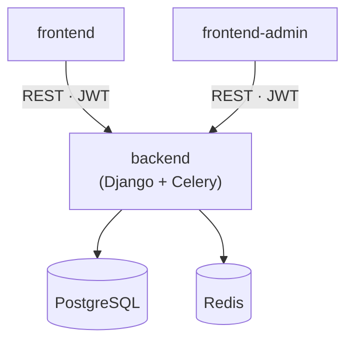

<p align="center">
  
</p>

---

# Request Manager

Workflow Support System for managing video shooting, filming and live-streaming
requests of [Budavári Schönherz Stúdió](https://bsstudio.hu).

[](https://github.com/BSStudio/request-manager/actions/workflows/backend.yml)
[](https://github.com/BSStudio/request-manager/actions/workflows/frontend.yml)
[](https://github.com/BSStudio/request-manager/actions/workflows/frontend-admin.yml)
[](LICENSE)

## Overview

The project is a monorepo made up of three deployable applications backed by
PostgreSQL and Redis:

| Component                          | Stack                                             | Description                                              |
| ---------------------------------- | ------------------------------------------------- | -------------------------------------------------------- |
| [`backend`](backend)               | Django, Django REST Framework, Celery, PostgreSQL | REST API, business logic, admin panel and async workers. |
| [`frontend`](frontend)             | React, Material UI, Vite                          | Public site where users submit and follow up requests.   |
| [`frontend-admin`](frontend-admin) | React, PrimeReact, TanStack Query, TypeScript     | Admin dashboard for staff to manage requests.            |

Both frontends are static builds served by the backend in production (through
WhiteNoise). Authentication is handled via OAuth2 (AuthSCH, BSS Login, Google,
Microsoft) with JWT tokens.



## Repository layout

```
.
├── backend/         Django REST API, Celery workers, admin panel
├── frontend/        Public React app (Vite)
├── frontend-admin/  Admin dashboard React app (Vite, TypeScript)
├── .devcontainer/   VS Code dev container (Python + Node + Poetry)
├── docker-compose.dev.yaml   PostgreSQL + Redis for local development
└── docker-compose.yaml       Full production-like stack
```

## Getting started

The fastest way to get a complete toolchain is the **dev container**, which
provisions Python, Node and Poetry and starts PostgreSQL + Redis automatically.

### Option A — Dev Container (recommended)

1. Install [Docker Desktop](https://www.docker.com/products/docker-desktop/) and
   the [VS Code Dev Containers](https://marketplace.visualstudio.com/items?itemName=ms-vscode-remote.remote-containers)
   extension.
2. Open the repository in VS Code and run **Dev Containers: Reopen in Container**.
3. Once the post-create step finishes, create the `.env` files (see each
   component's README) and run the apps.

> **Windows + WSL:** if the container fails to start with a
> `distro-services/<distro>.sock: no such file` error, enable Docker Desktop →
> Settings → Resources → **WSL Integration** for your distro (e.g. `Debian`).

### Option B — Manual setup

Start the infrastructure, then follow each component's README:

```bash
docker compose -f docker-compose.dev.yaml up -d   # PostgreSQL + Redis
```

- [Backend setup](backend/README.md)
- [Frontend setup](frontend/README.md)
- [Admin dashboard setup](frontend-admin/README.md)

**Prerequisites for manual setup:** Python + [Poetry](https://python-poetry.org/)
and Node.js — the exact versions are pinned in `backend/.python-version` and the
`.nvmrc` files — plus Docker for PostgreSQL + Redis.

## Development

This repository uses [pre-commit](https://pre-commit.com/) for formatting and
linting (Black, isort, flake8, Prettier, ESLint and more). Install the hooks at
once from the repository root:

```bash
pipx install pre-commit   # or: pip install pre-commit
pre-commit install
```

Run all checks manually with `pre-commit run --all-files`.

Node and Python versions are pinned in a single place each and kept up to date
by Renovate:

- Node.js — `frontend/.nvmrc` and `frontend-admin/.nvmrc`
- Python — `backend/.python-version`

### Windows: enable symbolic links

`frontend-admin/index.html` is a symlink. To check it out correctly on Windows,
enable Developer Mode (Settings → For developers → Developer Mode) and turn on
symlink support in Git:

```bash
git config --get core.symlinks
git config --replace-all core.symlinks true
```

Then re-checkout the file: `git checkout -- frontend-admin/index.html`.

## License

Distributed under the GNU General Public License v3.0. See [`LICENSE`](LICENSE).
